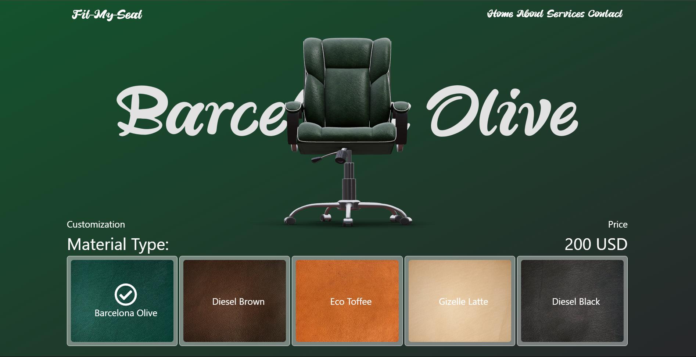

# Fit My Seat

## Simple Office Chair configurator App created with react three fiber.

### Steps to run the app

1. Clone the repo
2. Run `npm install`
3. Run `npm run dev`
4. Open [http://localhost:5173](http://localhost:5173) with your browser to see the result.

### [Live Demo](https://fitmyseat.netlify.app/)

